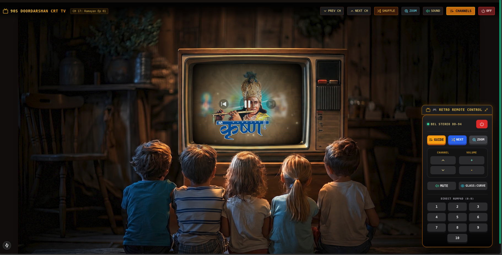

# 📺 Nostalgic TV — 90s Doordarshan CRT Experience

> A retro-nostalgic web app that recreates the magic of watching 90s Indian television — Doordarshan, Mahabharat, Ramayan, vintage cricket, and classic ads — all on an authentic CRT TV room scene, right in your browser.



---

## ✨ Features

### 🎮 Retro Remote Control
- Floating vintage **BEL STEREO DD-94** remote with amber glow aesthetic
- **GUIDE** — opens the full EPG (Electronic Programme Guide) channel browser
- **SHUFFLE / NEXT** — instantly rotates to a different video/episode on the current channel
- **ZOOM** — smooth cinematic zoom into the TV screen (press `Z` or click ZOOM)
- **Channel rockers** — CH▲ / CH▼ to flip through all 25 channels
- **Volume** — +/− controls with real-time OSD display
- **MUTE** — toggle audio with a single click
- **GLASS:CURVE** — toggle authentic CRT glass curvature effect
- **Direct numpad** (1–10) — jump to channels instantly

### 📡 25 Channels Across 4 Categories

| Category | Channels |
|---|---|
| 📺 **90s Indian Ads** | Classic Doordarshan commercial breaks |
| 🏹 **Mahabharat** | B.R. Chopra's epic series (all ~94 episodes) |
| 🕉️ **Ramayan** | Ramanand Sagar's complete serial |
| 🏏 **Vintage Cricket** | Classic India cricket match highlights |

### 🔄 Dynamic Daily Video Engine
- **No same video twice in a row** — each channel auto-rotates to a different video every day using a deterministic daily hash (day-of-year + channel number + manual offset)
- **Series episodes** rotate automatically for Mahabharat & Ramayan using `&index` offsets
- Manual **SHUFFLE** button lets you skip to the next video instantly at any time

### 📺 Authentic CRT TV Experience
- Real-world TV room background — kids seated on the floor watching TV (just like the 90s!)
- YouTube iframe **pixel-perfectly fitted** inside the CRT frame of the TV
- **CRT scanline overlay** (off / light / heavy modes)
- **Glass curvature** effect with vignette & glare
- **Phosphor ambient glow** cast onto the room when TV is on
- Smooth **channel-change static noise** effect with 280ms static flash
- **OSD (On-Screen Display)** banner for channel name, volume, mute state

### ⌨️ Keyboard Shortcuts

| Key | Action |
|---|---|
| `↑` | Next channel |
| `↓` | Previous channel |
| `→` | Volume up |
| `←` | Volume down |
| `M` | Toggle mute |
| `Z` | Zoom in / out |
| `Space` / `P` | Toggle power |
| `0–9` | Jump to channel number |

---

## 🚀 Getting Started

### Prerequisites
- Node.js 18+
- npm or yarn

### Installation

```bash
git clone https://github.com/PratyushKumar43/nostalgictv.git
cd nostalgictv
npm install
npm run dev
```

Open [http://localhost:3000](http://localhost:3000) in your browser.

### Production Build

```bash
npm run build
npm start
```

---

## 🛠️ Tech Stack

| Layer | Technology |
|---|---|
| Framework | [Next.js 15](https://nextjs.org/) (App Router) |
| Language | TypeScript |
| Styling | Tailwind CSS v3 |
| Icons | [Lucide React](https://lucide.dev/) |
| Video | YouTube IFrame API (no backend needed) |
| State | React Context API |
| Font | Google Fonts — Geist / Mono |

---

## 📁 Project Structure

```
src/
├── app/
│   ├── page.tsx               # Root page with TopBarControls
│   ├── layout.tsx             # App layout & metadata
│   └── globals.css            # Global styles
├── components/
│   ├── tv/
│   │   ├── TVScene.tsx        # TV room layout & zoom logic
│   │   ├── CRTScreen.tsx      # CRT viewport with click-to-unmute
│   │   ├── CRTShaderOverlay.tsx  # Scanlines, vignette, glare
│   │   └── VideoPlayer.tsx    # YouTube iframe embed logic
│   ├── remote/
│   │   ├── RemoteControl.tsx  # Floating vintage remote
│   │   └── RemoteButton.tsx   # Styled button component
│   └── modals/
│       └── ChannelGuideModal.tsx  # EPG channel guide with category tabs
├── context/
│   └── TVContext.tsx          # Global TV state (power, channel, volume, zoom…)
├── lib/
│   ├── playlistData.ts        # 25 channels with video pools
│   └── soundEffects.ts        # Button click / static noise SFX
└── types/
    └── tv.ts                  # TypeScript interfaces & types
```

---

## 🌐 Content

All content is streamed live from YouTube — no files are downloaded or stored. The app only holds channel metadata and YouTube video IDs.

---

## 📸 Screenshot


---

## 📝 License

MIT — free to use, modify, and share.

---

## 🙏 Credits

- Inspired by the golden era of **Doordarshan** (1980s–90s Indian state television)
- Background artwork generated with AI image generation
- Content sourced from public YouTube channels covering classic Indian television

---

*"Woh Doordarshan ke zamaane yaad hain... 📺"*
